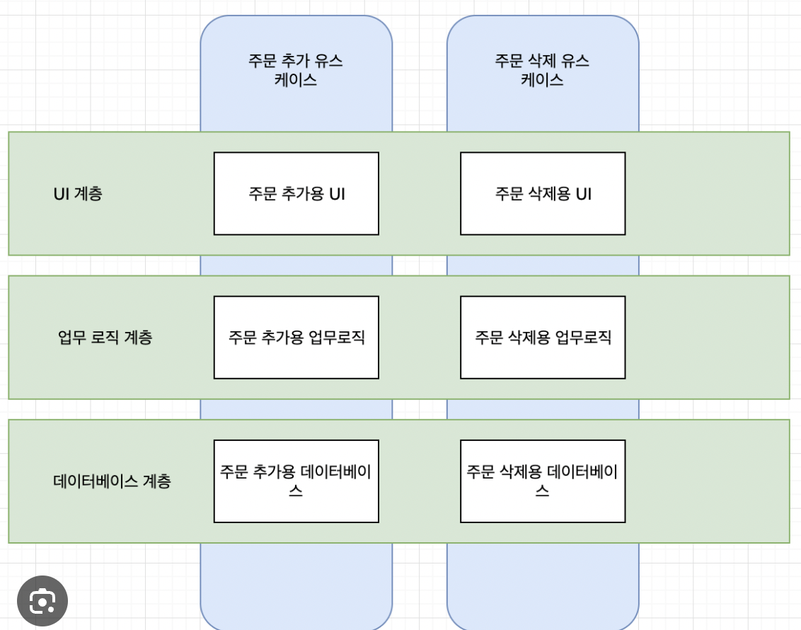

## 핵심 내용 요약
- 좋은 아키텍처란 쉽게 이해하고, 개발하고, 운영, 유지보수하고 배포하게 해주는 시스템이다.
- 좋은 아키텍트는 세부사항에 대한 결정을 미루고(언제든지 바뀔수 있다는 가정을 하고) 고수준의 정책(인터페이스)를 정한다.
- 유스케이스? 시스템의 핵심 비즈니스와 관련된 기능 (장바구니시스템이라면 장바구니 담는 유스케이스/장바구니 삭제 유스케이스가 있다)
- 결합 분리: 계층을 나누고 유스케이스별 aspect를 사용한다. -> 스케이스/계층이 분리되면 개발도 배포도 쉬워진다.

- 선긋기 : 의존성 역전 원칙에 따라, 각 infra 계층은 업무규칙 인터페이스에 의존할것. 
    

## 인상 깊은 내용
> 특히 기억에 남거나 공감된 부분
- 좋은 아키텍처는 시스템이 모노리틱으로 시작하더라도, 이후 독립적으로 배포가능한 단위들의 집합으로 성장하고, 또 독립적인 서비스나 마이크로 서비스 수준까지 성장할 수 있도록 만들어져야 한다.

## 이해가 어려웠던 내용
> 설명이 어렵거나 개념이 잘 이해되지 않았던 부분

## 의문이 드는 내용 / 동의하지 않는 내용
> 책의 주장에 대한 비판적인 관점
- 처음에는 유사해보이지만 시간이 지나면서 서로다른 방향으로 발전할수 있는 서로 다른 유스케이스의 aspect을 통일하는 것에 유의하라는 내용 -> 이런 방식이면 공통 컴포넌트를 만들기 너무 어렵지 않을까. 묶은걸 분리 vs 분리된것을 합치기

## 현업 경험 공유
> 실제 업무에서 겪었던 경험이나 사례
